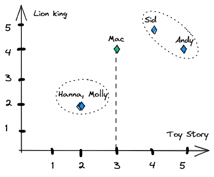

# Get movie recommendations based on your taste
Users rate movies they've seen, and get recommendations from other users who rate movies similarly.

The problem that is tackled here is that in other services like IMDB and Rotten Tomatoes, a high rating from any other user always brings up the average score on the movie. The idea here is that ratings from users who do not share our taste should be ignored.

## Who shares your taste in movies?
Every user has a position in the space formed by all the movies in the database, see the illustration below with  2 movies:

Hanna and Molly will be recommended each other's favorite movies. The same goes for Sid and Andy. Mac has seen the Lion King but not yet Toy Story and is automatically placed on the Toy Story scale at the middle score 3 and ends up closest to Sid.

## Goal of the project
After involving 50 users with 20 movies each, start getting recommendations that beats those you get from IMDB, Netflix or even friends that thought they knew you.

## Get started
With Window's CMD (almost the same as with a linux shell):
* Make a virtual environment `python -m venv env`
* Activate the virtual environment with `env\Scripts\activate` (Deactivate with `deactivate`)
* Install requirements `pip install -r requirements.txt`
* Add the following to a file called `.env`

    SECRET_KEY=rqr_cjv4igscyu8&&(0ce(=sy=f2)p=f_wn&@0xsp7m$@!kp=d
    DEBUG=True
    ALLOWED_HOSTS=.localhost,127.0.0.1
    DATABASE_URL=sqlite:///db.sqlite3
    EMAIL_BACKEND=django.core.mail.backends.console.EmailBackend

* Run `python manage.py migrate`
* Run `python manage.py runserver`
* Play around at http://127.0.0.1:8000/ or http://127.0.0.1:8000/admin/ (admin page is slow, shouldn't have added that many movies to the sqlite db)

Get started with the admin user "ben" with password "ben". The other users also has the same password as their name, e.g. "mac, mac".

## Contributing
To achieve the goal of this project, the site needs to be user friendly enough to have the users stay long enough to rate enough movies. If users give up because they get frustrated with the search function, the search should have the highest priority.

This list is sorted in order of estimated importance:
* Search
  * Have the result list populate while typing.
  * When searching for "A", IMDB returns 3 movies named "A" but this site returns random movies that has an "A" in their titles.

* Associate images with movie titles
  * Find images for as many titles as possible.
  * Add images to the database.
  * Show images together with the titles.

* Front end
  * Make the site look more like what's proposed in [design.pdf](design.pdf).
  * Make a new design from scratch

* Automatic database upgrades
  * New titles are released every day, and the process of importing them into this project should be automated.

* Page scaling for devices with different screen sizes
  * It looks kind of ok for mobile devices, but not for larger screens.

* Sign up process
  * How can it be designed to be easier/faster for the users?

* Domain name
    * The site needs a domain name. Filmtips.xyz was used in the proof of concept  and could work for the next phase even though the .xyz seems fishy and might make people wary about visiting. Filmtips&#46;com demands way too much money.

* Filter irrelevant movies
  * Most likely nobody will ever rate "Don Álvaro o la fuerza del sino (1908)" so it can safely be removed along with other old movies.

* Database design
  * The database used for the proof of concept was postgreSQL
    * Is it the right choice?
    * Are there better ways of organizing the data, than what's done now with Movies, Ratings and Users?

* Importing ratings from other sites.
  * Make it easier for people to join by enabling them to import lots of ratings they've already made at other sites.

* Algorithm improvements
  * Place users at the average score of an unseen movie instead of at the middle score 3?

#

Reference material for setting up this project
https://simpleisbetterthancomplex.com/series/beginners-guide/1.11/